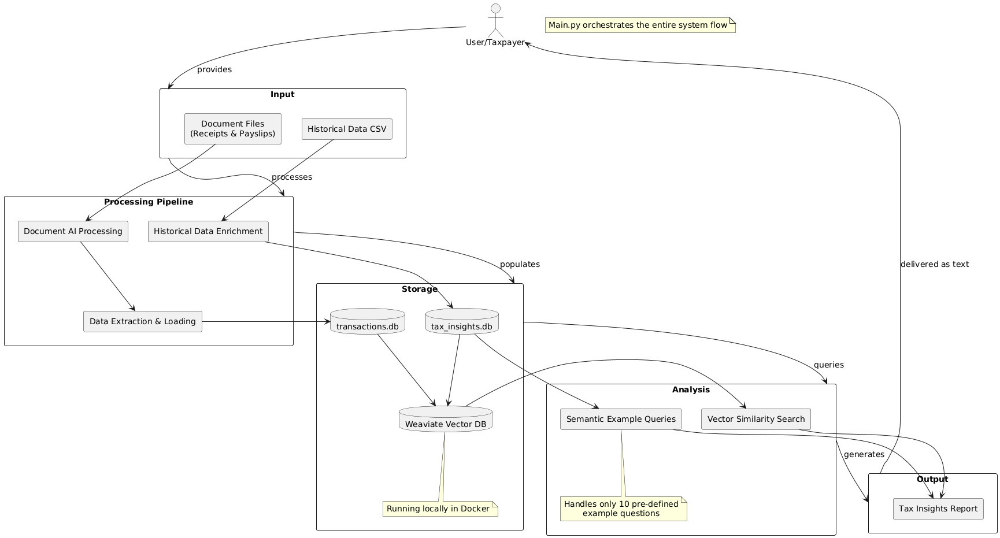
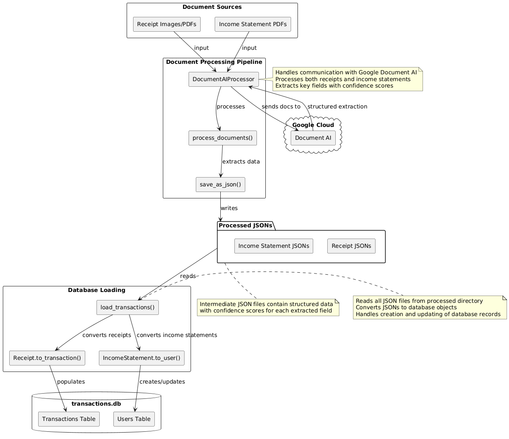
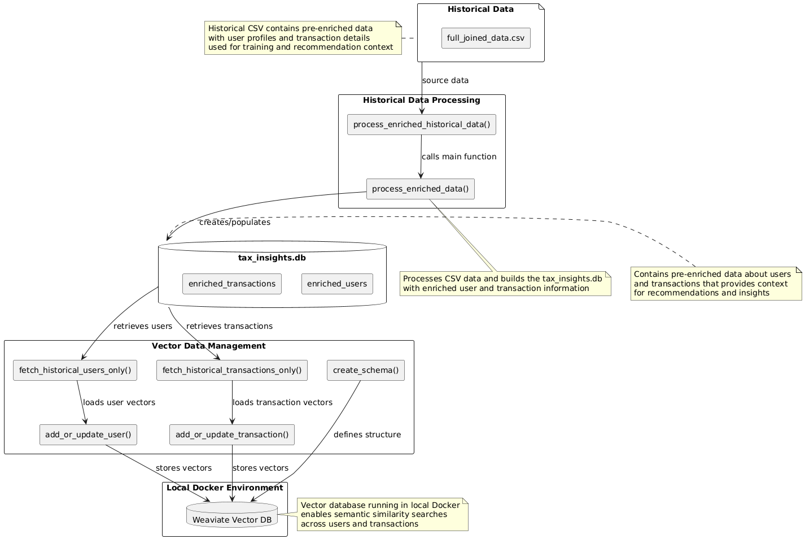
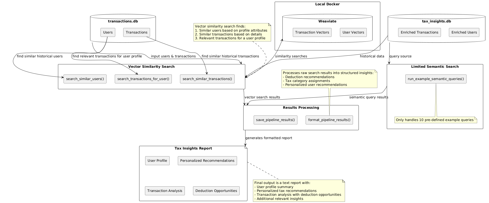
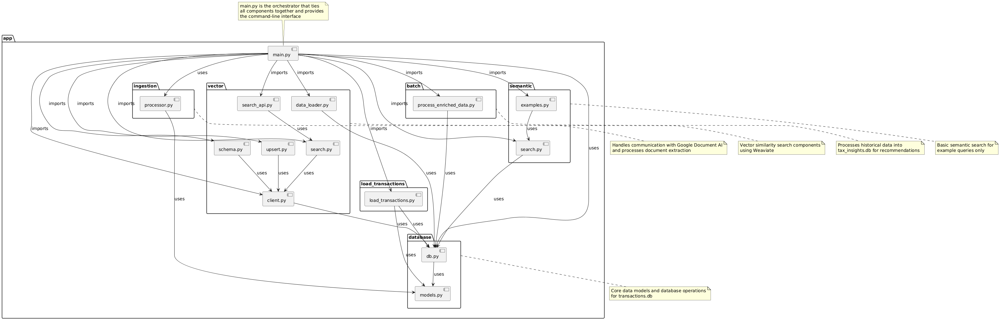

# Taxfix Tax Processing System

## System Architecture Overview

This document provides a comprehensive overview of the Taxfix Tax Processing System's architecture. The system processes tax-related documents using AI, extracts structured information, performs similarity analysis against historical data, and generates personalized tax insights and recommendations.



### Core System Capabilities

- **Document AI Processing**: Extract structured data from receipts and income statements
- **Transaction & User Data Management**: Store and manage financial transactions and user profiles
- **Vector Similarity Search**: Find similar historical user profiles and transactions
- **Semantic Query Handling**: Answer predefined tax-related questions
- **Tax Insights Generation**: Produce personalized tax recommendations and deduction opportunities

The system is designed as a data pipeline that transforms unstructured document inputs into structured tax insights through multiple processing stages.

## System Components

### Document Processing Pipeline



The document processing pipeline handles the extraction of structured information from unstructured documents:

1. **Input Processing**: The system accepts two primary document types:
   - Receipts (images/PDFs) - Processed for transaction information
   - Income statements (PDFs) - Processed for user income and occupation data

2. **Google Document AI Integration**: 
   - The `DocumentAIProcessor` class in `app/ingestion/processor.py` interfaces with Google Cloud's Document AI
   - Uses different processor IDs for receipts vs. income statements
   - Extracts text, form fields, and entities with confidence scores

3. **Structured Data Extraction**:
   - JSON files are created as intermediate representation
   - Receipt data includes vendor, amount, date, line items
   - Income statement data includes earnings, taxes, occupation information

4. **Database Loading**:
   - `load_transactions()` from `app/load_transactions.py` processes JSONs into database records
   - `Receipt.to_transaction()` converts receipt data to transaction records
   - `IncomeStatement.to_user()` extracts and updates user information

**Key Code Components:**
```python
# app/ingestion/processor.py
class DocumentAIProcessor:
    def process_document(self, file_path, doc_type):
        # Selects appropriate processor ID based on doc_type
        # Sends document to Google Document AI
        # Returns structured data with confidence scores

# app/main.py
def process_documents(input_dir, output_dir, doc_type):
    processor = DocumentAIProcessor()
    for file in files:
        result = processor.process_document(str(file), doc_type)
        output_file = output_path / f"{file.stem}.json"
        processor.save_as_json(result, str(output_file))
```

### Data Models and Storage

The system uses SQLite databases to store processed information:

1. **transactions.db**: Stores current user transactions and profiles
   - Users table - Created from income statements
   - Transactions table - Created from receipts

2. **tax_insights.db**: Stores enriched historical data
   - Enriched users - Historical user profiles with recommendations
   - Enriched transactions - Historical transactions with tax insights

**Key Data Models:**
```python
# app/database/models.py
class User(BaseModel):
    # User profile data from income statements
    user_id: str
    occupation_category: Optional[str]
    annualized_income: Optional[float]
    annualized_tax_deductions: Optional[float]
    # ...

class Transaction(BaseModel):
    # Financial transaction data from receipts
    transaction_id: str
    user_id: str
    receipt_id: str
    transaction_date: datetime
    amount: float
    category: str
    # ...

class Receipt(BaseModel):
    # Raw receipt data with confidence scores
    id: str
    file_path: str
    supplier_name: Optional[str]
    total_amount: Optional[float]
    line_items: List[LineItem] = []
    # ...

class IncomeStatement(BaseModel):
    # Income statement/payslip data
    id: str
    file_path: str
    gross_earnings: Optional[float]
    net_pay: Optional[float]
    occupation_category: Optional[str]
    tax_items: List[TaxItem] = []
    # ...
```

### Historical Data Enrichment



The historical data enrichment process creates the knowledge base required for generating tax insights:

1. **CSV Data Source**:
   - Historical data is provided in a pre-enriched CSV file
   - Contains user profiles, transactions, and tax insights
   - Located at `notebooks/data/full_joined_data.csv`

2. **Processing Pipeline**:
   - `process_enriched_historical_data()` in `app/main.py` orchestrates the process
   - `process_enriched_data()` from `app/batch/process_enriched_data.py` handles the actual processing
   - Creates and populates the tax_insights.db database

3. **Vector Database Integration**:
   - Weaviate vector database runs locally in Docker
   - Historical users and transactions are loaded as vectors for similarity search
   - Schema creation and data loading handled by `app/vector` modules

**Key Code Components:**
```python
# app/main.py
def process_enriched_historical_data():
    tax_insights_db = "app/data/db/tax_insights.db"
    # Check if database exists and has records
    process_enriched_data()  # Process historical CSV into database

# app/vector/upsert.py
def add_or_update_user(client, user_data):
    # Convert user data to vector representation
    # Store in Weaviate for similarity search
    
def add_or_update_transaction(client, transaction_data):
    # Convert transaction data to vector representation
    # Store in Weaviate for similarity search
```

### Analysis and Recommendation Engine



The analysis and recommendation system ties everything together to produce tax insights:

1. **Vector Similarity Search**:
   - `search_similar_users()` - Finds historical users with similar profiles
   - `search_similar_transactions()` - Finds similar historical transactions
   - `search_transactions_for_user()` - Finds relevant transactions for a user profile
   - Vector similarity enables finding patterns across dimensional data

2. **Limited Semantic Search**:
   - Handles only 10 pre-defined example queries
   - `run_example_semantic_queries()` in `app/semantic/examples.py`
   - Provides natural language understanding for specific tax questions

3. **Results Processing**:
   - `format_pipeline_results()` transforms raw search results into structured insights
   - `save_pipeline_results()` creates a formatted text report
   - Includes user profile, transaction analysis, and recommendations

**Vector Search Pipeline:**
```python
# app/main.py
def run_vector_search_pipeline(skip_ingestion=False, run_semantic_queries=True):
    # Connect to Weaviate
    client = get_weaviate_client()
    
    # Load data from transactions.db
    input_users = [...] # All users from transactions.db
    input_transactions = [...] # All transactions from transactions.db
    
    # Find similar historical users
    for input_user in input_users:
        similar_users = search_similar_users(client, user_data=search_user, limit=5)
        
        # Filter and process results
        users_with_recommendations = [...] # Filter for meaningful recommendations
        
        # Find similar transactions for this user
        for tx in user_transactions:
            similar_txs_results = search_similar_transactions(client, transaction_data=search_tx, limit=5)
            
    # Format and save results
    save_pipeline_results("app/data/processed", combined_results)
```

### Output and Results

The final output of the system is a comprehensive tax insights report containing:

1. **User Profile Summary**:
   - Occupation, income, and tax deduction details
   
2. **Personalized Recommendations**:
   - Tax optimization suggestions based on similar historical users
   - Confidence levels for each recommendation
   
3. **Transaction Analysis**:
   - Categorization of transactions
   - Identification of deduction opportunities
   - Similar historical transactions as reference points
   
4. **Additional Relevant Insights**:
   - Transactions from similar users that might be relevant
   - Tax category assignments
   - Deduction explanations

**Results Formatting:**
```python
# app/main.py
def format_pipeline_results(results: str) -> str:
    # Parse raw output into structured data
    structured_data = {
        "user_details": { "input_user": {}, "similar_users": [] },
        "transactions": {
            "input_transactions": [],
            "similar_transactions": {},
            "relevant_transactions": []
        },
        "recommendations": [],
        "tax_insights": {}
    }
    
    # Format into readable sections
    formatted_output = []
    # Add user profile section
    # Add recommendations section
    # Add transaction analysis section
    # Add relevant transactions section
    
    return "\n".join(formatted_output)
```

## Code Organization



The system's code is organized into specialized modules:

1. **app/main.py**: Central orchestrator with command-line interface
   - Parses arguments and controls execution flow
   - Ties together all components
   - Provides progress reporting and error handling

2. **app/ingestion**: Document processing components
   - `processor.py` - Google Document AI integration

3. **app/database**: Data models and database operations
   - `models.py` - Pydantic models for all data types
   - `db.py` - Database connection and operations

4. **app/batch**: Historical data processing
   - `process_enriched_data.py` - CSV processing into tax_insights.db

5. **app/vector**: Vector similarity search components
   - `client.py` - Weaviate connection management
   - `schema.py` - Vector database schema definition
   - `upsert.py` - Data insertion into vector database
   - `search.py` - Vector similarity search functions
   - `data_loader.py` - Data loading utilities

6. **app/semantic**: Semantic search functionality
   - `search.py` - Core semantic search functions
   - `examples.py` - Pre-defined example queries

## Command Line Interface

The system provides a flexible command-line interface through `app/main.py`:

```python
# Usage examples:
# Process all document types:
python -m app.main

# Process only receipts:
python -m app.main --type receipt --input app/data/receipt

# Process only income statements:
python -m app.main --type income_statement --input app/data/income_statement 

# Skip database creation:
python -m app.main --skip-db

# Skip vector search:
python -m app.main --skip-vector

# Skip example semantic queries:
python -m app.main --skip-examples

# Run only vector search pipeline:
python -m app.main --vector-only
```

## Design Decisions and Trade-offs

### SQLite for Data Storage
- **Pro**: Simple, file-based, no external dependencies
- **Con**: Limited concurrency, not suitable for high-volume production

### Google Document AI Integration
- **Pro**: High-quality document extraction with confidence scores
- **Con**: External dependency, requires Google Cloud credentials

### Weaviate for Vector Search
- **Pro**: Powerful semantic search capabilities
- **Con**: Requires Docker, adds complexity to setup

### Two-Step Processing (Document → JSON → Database)
- **Pro**: Separation of concerns, intermediate inspection possible
- **Con**: Additional disk I/O, storage requirements

### Pre-Defined Semantic Queries
- **Pro**: Controlled, predictable semantic search behavior
- **Con**: Limited flexibility, cannot handle arbitrary questions


## Key Design Decisions & Trade-offs 


---

### 1. Document Processing  
- **Decision:** Google Document AI with separate processors for receipts and income statements; two-stage flow (raw → JSON → DB).  
  - **Pros:** high field-level accuracy; confidence scores enable manual review; processor specialization.  
  - **Cons:** external API cost/latency/outage risk; environment-variable setup; intermediate JSON increases storage.

### 2. Data Storage  
- **Decision:** Two SQLite files (`transactions.db` for current data, `tax_insights.db` for history) plus a local Weaviate instance for vectors.  
  - **Pros:** lightweight deployment; clear separation of concerns; semantic search capability.  
  - **Cons:** data duplication and sync burden; SQLite concurrency limits; Docker dependency for Weaviate.

### 3. Embedding & Vector Search  
- **Decision:** Provider-agnostic embedding layer (OpenAI or Vertex); separate Weaviate classes for users and transactions; ten predefined semantic-query templates.  
  - **Pros:** easy provider switch; tax-specific text preparation; semantic matching beyond keywords.  
  - **Cons:** extra configuration paths; subtle differences between embedding models; limited coverage for new query types.

### 4. Enrichment Pipeline  
- **Decision:** Batch enrichment that merges GPT-4o deductibility classification, Ward-PCA peer clustering, and CausalForest uplift modelling.  
  - **Pros:** multiple analytic lenses (legal deductibility, peer comparison, causal savings); confidence scores on every output.  
  - **Cons:** heavy CPU load (500-tree forests); CSV preprocessing dependency; cross-model integration complexity.

### 5. Model Choices  
- **Causal uplift:** `CausalForestDML` with 500 trees and double random-forest nuisance models — accuracy↑ vs. compute↑, low interpretability.  
- **Peer clustering:** Ward linkage on PCA-reduced, income-normalized features — balanced clusters vs. loss of absolute spending info.  
- **Tax deductibility:** GPT-4o with Pydantic-validated structured output — flexible rule coverage vs. API cost and version drift.

### 6. Query Processing  
- **Decision:** Rule-based query-type classifier routes requests to dedicated handlers; hybrid vector + filter search.  
  - **Pros:** predictable answers; personalization toggle; controlled latency.  
  - **Cons:** manual expansion for new intents; analysis step adds delay.

### 7. Reporting  
- **Decision:** Single `format_pipeline_results` builds a multi-section report (profile, transactions, recommendations).  
  - **Pros:** unified output; downstream consumers rely on one format.  
  - **Cons:** tight coupling to internal schema; costly to change.

### 8. Interface & Orchestration  
- **Decision:** CLI with granular flags (`--skip-db`, `--vector-only`, etc.) orchestrated by `main.py`; hierarchical package layout.  
  - **Pros:** run partial pipelines for testing; clear module boundaries.  
  - **Cons:** many flag permutations to test; deep import paths complicate refactors.

### 9. Reliability & Observability  
- **Decision:** extensive debug logging, colored output, broad try/except fallbacks, path normalization, and automatic directory creation.  
  - **Pros:** detailed diagnostics; graceful degradation; cross-platform path handling.  
  - **Cons:** verbose logs impact performance; duplicated error patterns; potential silent failures.

### 10. Testing  
- **Decision:** No automated tests were written for any module. 

### 11. Evaluation  
- **Decision:** No evaluation or benchmark of document ingestion quality was performed.  
