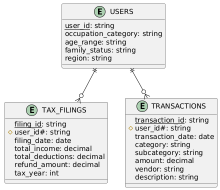

# taxfix-taxflow

# Tax System Database Schema

## Overview
This database schema represents the foundational data structure of a tax management system. It contains the raw, cleaned data that serves as the source of truth for user tax information, filings, and financial transactions. This schema is the starting point for any tax-related analytics, reporting, or further data processing.

## Data Context
The schema contains three core tables that capture:
- User demographic information (USERS)
- Annual tax filing records (TAX_FILINGS)
- Individual financial transactions (TRANSACTIONS)

This raw data structure is designed to:
- Serve as the primary data source for tax-related operations
- Enable basic tax filing and transaction tracking
- Support initial data analysis and reporting
- Provide a foundation for more complex data transformations or analytics

## Schema Description

### USERS
Core dimension table containing user demographic information:
- Primary Key: `user_id` (string) - Unique identifier for each user
- Occupation category and age range
- Family status and regional information

### TAX_FILINGS
Fact table recording annual tax submissions:
- Primary Key: `filing_id` (string) - Unique identifier for each tax filing
- Foreign Key: `user_id` (string) - References USERS.user_id
- Total income and deductions
- Refund amounts
- Tax year tracking

### TRANSACTIONS
Fact table storing detailed financial records:
- Primary Key: `transaction_id` (string) - Unique identifier for each transaction
- Foreign Key: `user_id` (string) - References USERS.user_id
- Categorized expenses and income
- Vendor information and transaction details
- Amount and date tracking

## Key Relationships
- `USERS.user_id` is the primary key in the USERS table
- `TAX_FILINGS.user_id` is a foreign key referencing `USERS.user_id`
- `TRANSACTIONS.user_id` is a foreign key referencing `USERS.user_id`
- Each user can have multiple tax filings (one per tax year)
- Each user can have multiple transactions