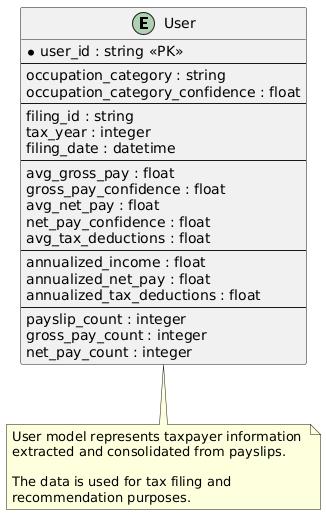
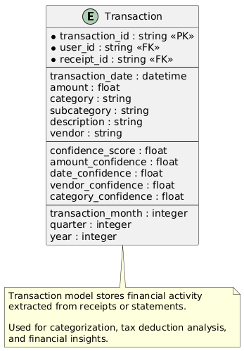
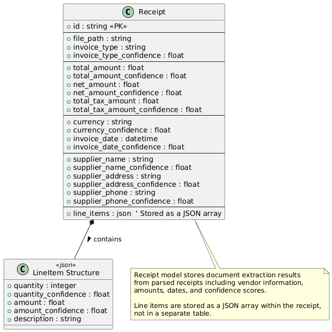
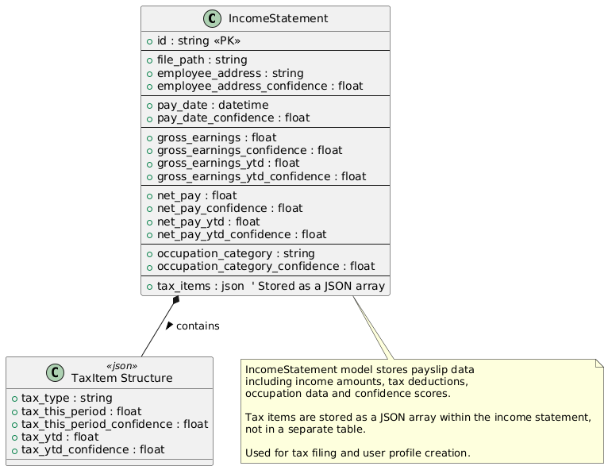
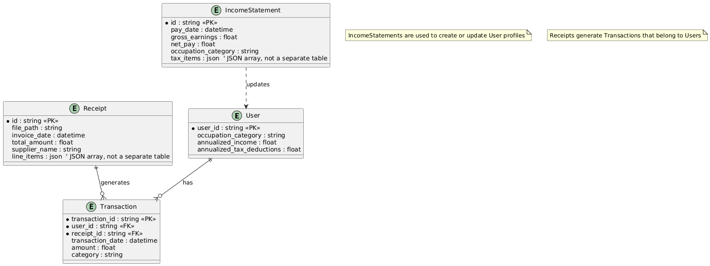

# Data Design Documentation

## Overview
This documentation describes the data structure of the tax processing system. It contains the core data models that serve as the foundation for user tax information, receipt processing, and financial transactions. This schema is the starting point for any tax-related analytics, reporting, or further data processing.

## Data Context
The system processes several types of data:
- User information extracted from payslips (income statements)
- Financial transactions extracted from receipts
- Historical tax data for comparative analysis and recommendations

These data structures are designed to:
- Process and extract information from user documents using AI
- Enable tax filing and deduction identification
- Support financial analysis and reporting
- Generate personalized tax recommendations

## Core Data Models

### User Model
The User model represents taxpayer information consolidated from payslips, providing the foundation for tax filing and recommendations.

**Key attributes:**
- Primary Key: `user_id` - Unique identifier for each user
- `occupation_category` - User's occupation information
- `annualized_income` - Projected annual gross income based on payslips
- `annualized_tax_deductions` - Projected annual tax deductions
- `filing_id`, `tax_year` - Tax filing information

### Transaction Model
The Transaction model stores financial activity extracted from receipts, used for categorization, tax deduction analysis, and financial insights.

**Key attributes:**
- Primary Key: `transaction_id` - Unique identifier for each transaction
- Foreign Keys: `user_id`, `receipt_id` - Link to user and source receipt
- `transaction_date`, `amount`, `category` - Core transaction details
- `vendor`, `description` - Additional transaction context
- `confidence_score` - AI extraction confidence metrics

### Receipt Model
The Receipt model stores document extraction results from processed receipts including vendor information, amounts, dates, and confidence scores.

**Key attributes:**
- Primary Key: `id` - Unique identifier for each receipt
- `total_amount`, `net_amount`, `total_tax_amount` - Financial values
- `supplier_name`, `supplier_address` - Vendor information
- `invoice_date`, `currency` - Transaction details
- `line_items` - JSON array of individual purchase items
- Various confidence scores for AI-extracted fields

### Income Statement Model
The Income Statement model stores payslip data including income amounts, tax deductions, occupation data, and confidence scores. Used for tax filing and user profile creation.

**Key attributes:**
- Primary Key: `id` - Unique identifier for each income statement
- `gross_earnings`, `net_pay` - Core income values
- `occupation_category` - Professional classification
- `pay_date` - Statement date
- `tax_items` - JSON array of tax deduction entries
- Various confidence scores for AI-extracted fields

## Data Relationships
The database schema has the following key relationships:

**Core relationships:**
- Users have many Transactions (one-to-many)
- Receipts generate Transactions (one-to-many)
- Income Statements update User profiles
- Line items are stored as JSON arrays within Receipts
- Tax items are stored as JSON arrays within Income Statements

## Schema Evolution
The data models are designed to accommodate the full tax processing pipeline:
1. Raw document processing via Google Document AI
2. Structured data extraction with confidence scores
3. Database storage with proper relationships
4. Vector and semantic search for similar taxpayer situations
5. Generation of tax insights and recommendations

## Viewing Documentation
All schema diagrams are available as PNG files in the `docs/schemas/images` directory for reference. The original PlantUML source files can be found in `docs/schemas/database` directory.

## Other Documentation

- `models/` - JSON schemas for API models
- `api/` - API endpoint specifications